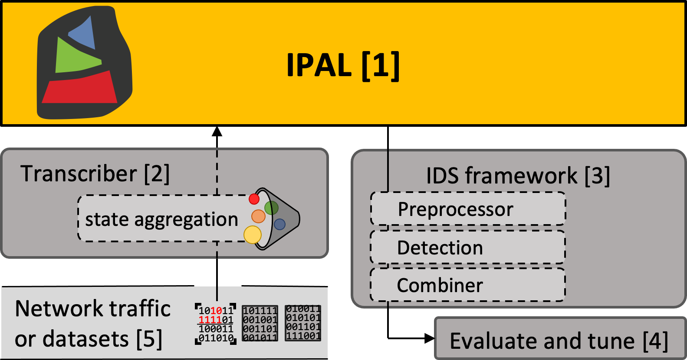

# IPAL Documentation

This repository should grow into a collection of helpful information around IPAL, the Industrial Protocol Abstraction Layer. Currently, it contains an overview, introduction, and tutorial on the basic operations of IPAL.

## Idea and Concept

The Industrial Protocol Abstraction Layer (IPAL) was invented due to the need for a standard interface for Intrusion Detection Systems (IDSs) operating in Industrial Control System (ICS) environments. Over time, ICSs have developed a plethora of different network protocols, e.g., Modbus, CIP, or S7, that are largely incompatible with each other. Yet, they share great similary w.r.t. their use cases, primarily transferring (physical) measurements or commands to ICS devices. This complicates the deployment of IDSs in ICS environments, as each detection approach has to be specially built for a given protocol as of now.

At the core of IPAL and to change this situation lies a standard message format (see below), which enables the decoupling of applications, such as IDS, from the underlying industrial protocol. Thereby, IDSs can be developed, evaluated, and deployed irrespective of the network protocol. At the same time, research benefits from IPAL since it can transfer many evaluation datasets into this common representation. Thereby, broader examinations of an IDS's performance can be conducted.

For further reading material, we recommend considering our introduction to IPAL and tutorial. Furthermore, our publication "IPAL: Breaking up Silos of Protocol-dependent and Domain-specific Industrial Intrusion Detection Systems." provides a solid background on industrial intrusion detection, the motivation, and the idea behind IPAL.



Overview of IPAL's repositories

- [1] Concept, documentation, and additional material around the IPAL ecosystem - [https://github.com/fkie-cad/ipal](https://github.com/fkie-cad/ipal)
- [2] Contains, among others, the IPAL transcriber, which converts network traffic into IPAL representation - [https://github.com/fkie-cad/ipal_transcriber](https://github.com/fkie-cad/ipal_transcriber)
- [3] Implementation of various IDS solutions operating on top of IPAL - [https://github.com/fkie-cad/ipal_ids_framework](https://github.com/fkie-cad/ipal_ids_framework)
- [4] Tools to evaluate and tune IDS solutions - [https://github.com/fkie-cad/ipal_evaluate](https://github.com/fkie-cad/ipal_evaluate)
- [5] A collection of datasets that can be used to evaluate IDS solutions - [https://github.com/fkie-cad/ipal_datasets](https://github.com/fkie-cad/ipal_datasets)

### IPAL message format

The transcriber parses each industrial protocol packet and writes one JSON line for each packet to the output. The 'id' is unique for each message. Source ('src') and destination ('dest') are strings with different address levels separated by ":". E.g. IP:Port:Device for Modbus, which can address sub-devices within one connection in theory. Activity is one of the following:

- Interrogate: Active request for data
- Inform: Response to requested data or unsolicited message
- Command: Set new values or command an action
- Action: Response to command or (unsolicited) performed action
- Confirmation: a packet solely designed as Layer-5 confirmation of prior msg - not restricted to Commands or Interrogations

The field 'data' contains a dictionary of all transmitted industrial process value names and values. Values are set to 'null', e.g., if this value is requested.

```json
{
  "id": 0,
  "timestamp": 1445465436.995232,
  "protocol": "s7",
  "malicious": null,
  "src": "10.10.10.20:49156",
  "dest": "10.10.10.10:102",
  "length": 82,
  "crc": true,
  "type": 1,
  "activity": "interrogate",
  "responds to": [],
  "data": {
    "16": null,
    "17": null,
    "18": null,
    "19": null,
    "20": null
  }
}
```

### IPAL state format

The state format represents the entire state, the values of all sensors and actuators of a physical process, for a given time. 'state' contains all observed variables and values. Each variable's name is a ':' separated list of its device and variable name. A state is labeled as 'malicious' if at least a single packet is malicious since the output of the last state.

```json
{
  "timestamp": 1445465437.00792,
  "state": {
    "10.10.10.10:102:16": 0,
    "10.10.10.10:102:17": 0,
    "10.10.10.10:102:18": 0,
    "10.10.10.10:102:19": 0,
    "10.10.10.10:102:20": 0
  },
  "malicious": null,
}
```

## Support Material

### Tutorial and getting started

If you are new to IPAL and are considering working with it, we provide you with a presentation that explains the main concepts and guides you through your first installation steps. Furthermore, we designed an extensive tutorial that showcases all software utilities.

Please refer to the files in the `tutorial` folder.

## Contribute

We are always looking for contributions such as:

- New support or enhancements for industrial protocols in the transcriber
- Further IDSs, ensemble methods
- Bugfixes, feature requests ...

## Publications

Below, we list publications that invent (parts of) IPAL as well as further associated publications that leverage IPAL.

### Main publications around IPAL

- Konrad Wolsing, Eric Wagner, Antoine Saillard, and Martin Henze. 2022. "IPAL: Breaking up Silos of Protocol-dependent and Domain-specific Industrial Intrusion Detection Systems." In 25th International Symposium on Research in Attacks, Intrusions and Defenses (RAID). 2022 [https://doi.org/10.1145/3545948.3545968 ](https://doi.org/10.1145/3545948.3545968)
- Konrad Wolsing, Eric Wagner, and Martin Henze. "Poster: Facilitating Protocol-independent Industrial Intrusion Detection Systems." Proceedings of the 2020 ACM SIGSAC Conference on Computer and Communications Security. 2020 [https://doi.org/10.1145/3372297.3420019](https://doi.org/10.1145/3372297.3420019)
- Olav Lamberts, Konrad Wolsing, Eric Wagner, Jan Pennekamp, Jan Bauer, Klaus Wehrle, and Martin Henze. "SoK: Evaluations in Industrial Intrusion Detection Research." Journal of Systems Research (jSys 2023). 2023 [http://doi.org/10.5070/SR33162445](http://doi.org/10.5070/SR33162445)
- Konrad Wolsing, Dominik Kus, Eric Wagner, Jan Pennekamp, Klaus Wehrle, and Martin Henze. "One IDS is not Enough! Exploring Ensemble Learning for Industrial Intrusion Detection." 28th European Symposium on Research in Computer Security (ESORICS). 2023 [http://doi.org/todo](http://doi.org/todo)

### Publications that use IPAL

- Konrad Wolsing, Lea Thiemt, Christian van Sloun, Eric Wagner, Klaus Wehrle, and Martin Henze. "Can Industrial Intrusion Detection Be SIMPLE?." 27th European Symposium on Research in Computer Security (ESORICS). 2022 [https://doi.org/10.1007/978-3-031-17143-7_28](https://doi.org/10.1007/978-3-031-17143-7_28)
